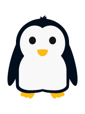
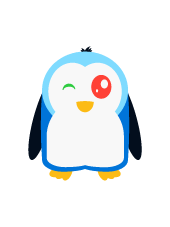

Cetzpenguins is a rewriting (very partial at the moment) of the [TikZpingus](https://github.com/EagleoutIce/tikzpingus) LaTeX package in [Typst](https://github.com/typst/typst) using [CeTZ](https://github.com/cetz-package/cetz), aiming to provide cute penguins to all the Typst documents that need them.

To draw the default penguin:
```Typst
#penguin()
```



The penguin can be customized, for the moment limited to colors and eye shape:
```Typst
#penguin(
  width:2cm,
  body-color:blue,
  head-color:aqua,
  left-eye:(color:red,
    shape:"shiny"),
  right-eye:(
    color:green,
    shape:"wink")
)
```


